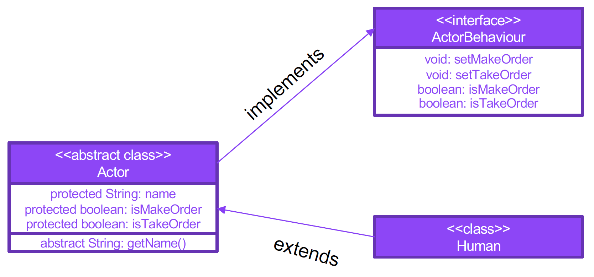
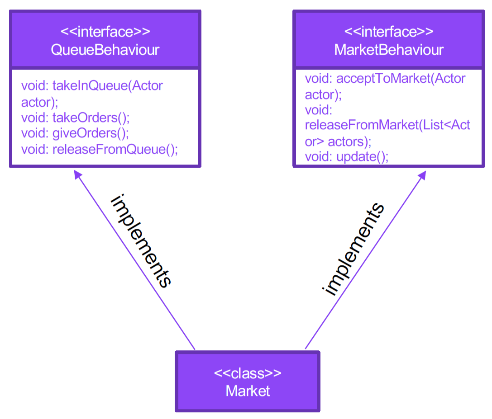
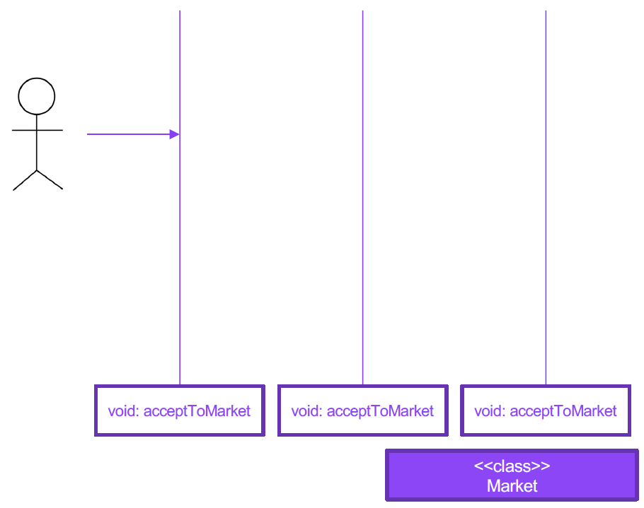

# Необходимо реализовать:

1. Интерфейс `ActorBehavoir`, который будет содержать описание возможных действий актора в очереди/магазине

2. Абстрактный класс `Actor`, который хранит в себе параметры актора, включая состояние готовности сделать заказ и факт получения заказа.\
**Дополнение**: для большего понимания, можно сделать методы-геттеры для имени и прочих "персональных данных" `abstract`

3. Класс `Human`, который должен наследоваться от `Actor` и реализовывать `ActorBehavoir`

# Необходимо реализовать строение классов, без конкретной реализации:

1. Интерфейс `QueueBehaviour`, который описывает логику очереди – помещение в/освобождение из очереди, принятие/отдача заказа

2. Интерфейс `MarketBehaviour`, который описывает логику магазина – приход/уход покупателей, обновление состояния магазина

3. Класс `Market`, который реализовывает два вышеуказанных интерфейса и хранит в списке список людей в очереди в различных статусах

# Домашнее задание

Реализовать класс Market и все методы, которые он обязан реализовывать.

Методы из интерфейсов:
* QueueBehaviour - имитируют работу очереди
* MarketBehaviour – помещает и удаляет человека из очереди
* метод update – обновляет состояние магазина (принимает и отдает заказы)

