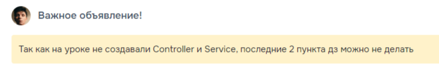

# Домашнее задание

* Создать класс `Поток`, содержащий в себе список `УчебныхГрупп` и реализующий интерфейс `Iterator`.
* Создать класс `StreamComparator`, реализующий сравнение количества групп, входящих в `Поток`.
* Создать класс `ПотокСервис`, добавив в него метод сортировки списка потоков, используя созданный `StreamComparator`.
* Модифицировать класс `Контроллер`, добавив в него созданный сервис.
* Модифицировать класс `Контроллер`, добавив в него метод сортирующий список потоков, путём вызова созданного сервиса.

